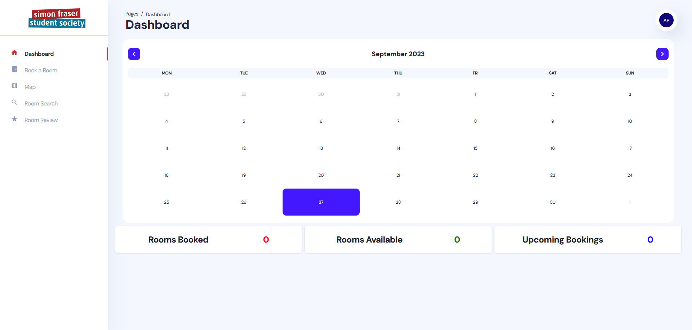
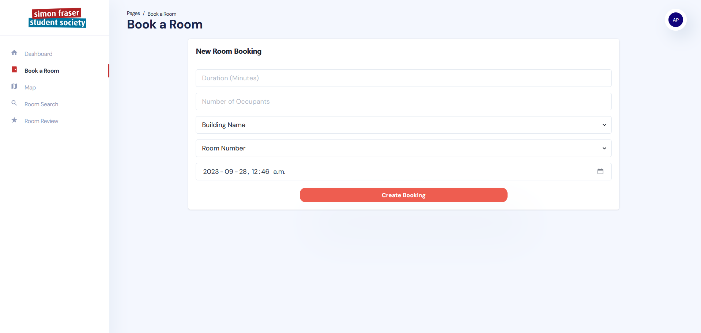
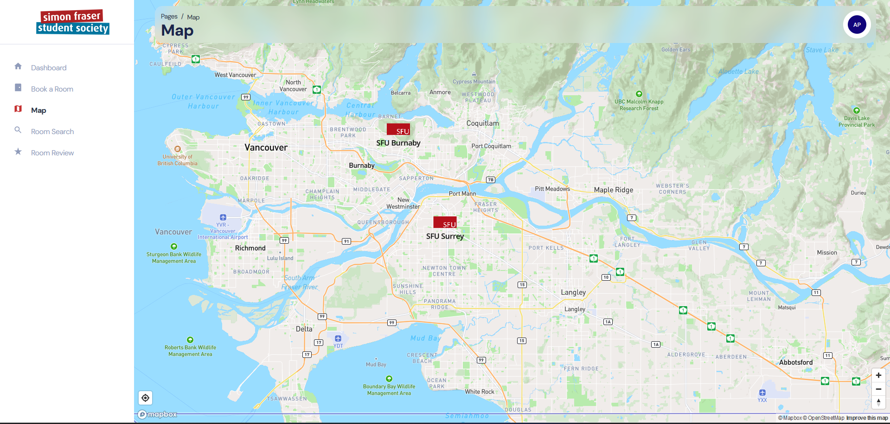

# 372 Room Booking App

# Project Overview

Group project for CMPT372 which shows an improved prototype of SFU's room booking system.  

Pictures of some parts of the UI are shown below: <br><br>
***Click on the arrow to expand the image***

<details>
  <summary>Main Calendar</summary>
<p align="center">
  
</p>
</details>

<details>
  <summary>Room Booking</summary>
<p align="center">
  
</p>
</details>

<details>
  <summary>Campus Map</summary>
<p align="center">
  
</p>
</details>

# Project Stack
- Typescript React with ChakraUI
- Express.js
- MySQL
- Linux

## Local Development: Frontend
Run the app locally:
```
cd room-booking-frontend

npm install

# start the local development server
vite 
OR
npm start
```

## Building:

Build into dist folder
```
npm run build 
```

Run the built version of the application locally:
```
npm run preview
```

# Contributors

- [Mike Ostrowka](https://github.com/Mike-Ostrowka)
  - Calendar UI
  - Room Review creation and viewing
  - Campus Map
- [Arshdeep Chhokar](https://github.com/chhokara)
  - Project setup
  - General UI
  - Statistics 
- [Nhi Mai-Do](https://github.com/n-maido)
  - Lost and Found features
  - Express Endpoints
- [Ryan Tio](https://github.com/rtiosfu)
  - Backend
  - Express Server


